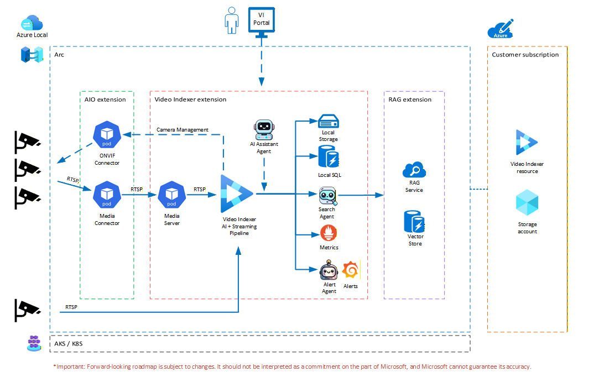
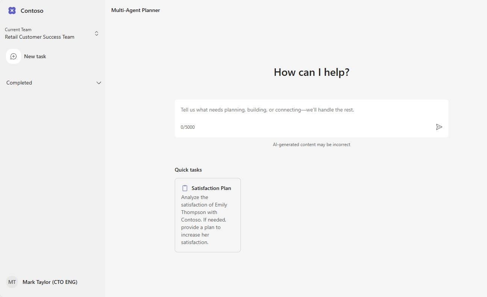

# Video-Agents-Foundry-Solution

Welcome to the *Video-Agents-Foundry-Solution*, designed to help businesses leverage AI agents for automating complex video analysts tasks.
This solution provides **end-to-end framework** for deploying AI-powered video analysis at the edge using Azure Video Indexer enabled by Azure Arc, combined with intelligent AI agents for automated decision-making and real-time video insights.  
The Video-Agents-Foundry-Solution allows users to process and analyze live and recorded video streams at the edge, extract AI insights, including speech transcription, OCR, face detection, object tracking, and action recognition and leverage **AI agents** to automate complex video analysis workflows with low latency and full data sovereignty.

> **_Note_:** In order to successfully deploy the VI Extension, you **must first** submit your subscription for approval and be approved. Please use this application link. [this form](https://aka.ms/vi-register).

**Comprehensive Guides**

For a detailed, step-by-step guide on creating an AKS cluster with GPU support and deploying the Video Indexer Arc extension, see:
- **[AKS-CLUSTER-SETUP.md](https://github.com/Azure-Samples/azure-video-indexer-samples/blob/master/VideoIndexerEnabledByArc/aks/AKS-CLUSTER-SETUP.md)** - Complete setup guide with output examples
- **[create-aks-cluster.sh](https://github.com/Azure-Samples/azure-video-indexer-samples/blob/master/VideoIndexerEnabledByArc/aks/create-aks-cluster.sh)** - Automated deployment script
> The guide includes GPU quota checking, troubleshooting tips, and support for live video processing.

 

[**SOLUTION OVERVIEW**](#solution-overview) \| [**QUICK DEPLOY**](#quick-deploy) \| [**BUSINESS SCENARIO**](#business-scenario) \| [**SUPPORTING DOCUMENTATION**](#supporting-documentation)

 

**Note:** With any AI solutions you create using these templates, you are responsible for assessing all associated risks and for complying with all applicable laws and safety standards. Learn more in the transparency documents for [Agent Service](https://learn.microsoft.com/en-us/azure/ai-foundry/responsible-ai/agents/transparency-note) and [Agent Framework](https://github.com/microsoft/agent-framework/blob/main/TRANSPARENCY_FAQ.md).
 

<h2>
Solution overview
</h2>

The solution leverages Azure Arc Service to extend Azure Video Indexer capabilities to edge environments running on Kubernetes clusters.
By deploying the Video Indexer Arc extension on an Arc-enabled AKS cluster with GPU support (NVIDIA), the solution enables real-time video processing close to the data source — reducing latency and ensuring data sovereignty. AI agents built on Azure OpenAI orchestrate the video analysis pipeline, automating tasks such as content moderation, safety monitoring, and business intelligence extraction from video feeds. The agentic architecture allows multiple specialized agents to collaborate on complex video analysis tasks, with each agent handling a specific domain such as speech analysis, visual recognition, or compliance checking.

### Solution architecture
||
|---|

 

### Resources

This template creates everything you need to get started with Microsoft Foundry:

| Resource | Description |
|----------|-------------|
| [Azure AI Project](https://learn.microsoft.com/azure/ai-studio/how-to/create-projects) | Provides a collaborative workspace for AI development with access to models, data, and compute resources |
| [Storage Account](https://learn.microsoft.com/azure/storage/blobs/) | Provides blob storage for application data and file uploads |
| [Application Insights](https://learn.microsoft.com/azure/azure-monitor/app/app-insights-overview) | *Optional* - Provides application performance monitoring, logging, and telemetry for debugging and optimization |
| [Log Analytics Workspace](https://learn.microsoft.com/azure/azure-monitor/logs/log-analytics-workspace-overview) | *Optional* - Collects and analyzes telemetry data for monitoring and troubleshooting |

### Additional resources
- [Azure Video Indexer enabled by Arc — Ignite 2025 Preview Blog](https://techcommunity.microsoft.com/blog/AzureArcBlog/ignite-2025-preview---intelligent-real-time-video-insights-and-agents-with-azure/4470704)
- [Azure Video Indexer Documentation](https://learn.microsoft.com/en-us/azure/azure-video-indexer/)
- [Azure Arc Documentation](https://learn.microsoft.com/en-us/azure/azure-arc/)
- [AKS Cluster Setup for Video Indexer Arc Extension](https://github.com/Azure-Samples/azure-video-indexer-samples/blob/master/VideoIndexerEnabledByArc/aks/AKS-CLUSTER-SETUP.md)
- [Azure Video Indexer Samples on GitHub](https://github.com/Azure-Samples/azure-video-indexer-samples)

 

### Key features

  
Click to learn more about the key features this solution enables

- **Edge-Deployed Video Analysis** — Run Azure Video Indexer on Arc-enabled Kubernetes clusters at the edge, bringing AI-powered video analysis closer to data sources for low-latency processing.
- **Real-Time & Batch Video Processing** — Support for both live video pipeline ingestion (RTSP streams) and batch processing of recorded video files.
- **Multimodal AI Insights** — Extract rich insights from video content including speech transcription, OCR, face detection, object tracking, scene detection, and action recognition.
- **AI Agent–Based Automation** — Leverage intelligent agents powered by Azure OpenAI to automate complex video analysis workflows, enabling automated decision-making and action triggering.
- **GPU-Accelerated Processing** — Utilize NVIDIA T4 GPUs (Standard_NC4as_T4_v3 VMs) for high-performance video processing at the edge.
- **Cloud-Managed Edge Deployments** — Manage and monitor edge deployments centrally through Azure Arc while processing video data locally.
- **Data Sovereignty & Compliance** — Process sensitive video data on-premises or at the edge, ensuring data residency and compliance requirements are met.
- **Extensible Agentic Architecture** — Build custom agent teams for domain-specific video analysis scenarios such as retail analytics, manufacturing quality control, or safety monitoring.

  
<h2>
Quick deploy
</h2>

### How to install or deploy
Follow the quick deploy steps on the deployment guide to deploy this solution to your own Azure subscription.

> **Note:** This solution accelerator requires **Azure Developer CLI (azd) version 1.18.0 or higher**. Please ensure you have the latest version installed before proceeding with deployment. [Download azd here](https://learn.microsoft.com/en-us/azure/developer/azure-developer-cli/install-azd).

[Click here to launch the deployment guide](./docs/deployment.md)
  

|  |  | [&message=Open&color=blue&logo=visualstudiocode&logoColor=white)](https://vscode.dev/azure/?vscode-azure-exp=foundry&agentPayload=eyJiYXNlVXJsIjogImh0dHBzOi8vcmF3LmdpdGh1YnVzZXJjb250ZW50LmNvbS9taWNyb3NvZnQvTXVsdGktQWdlbnQtQ3VzdG9tLUF1dG9tYXRpb24tRW5naW5lLVNvbHV0aW9uLUFjY2VsZXJhdG9yL3JlZnMvaGVhZHMvbWFpbi9pbmZyYS92c2NvZGVfd2ViIiwgImluZGV4VXJsIjogIi9pbmRleC5qc29uIiwgInZhcmlhYmxlcyI6IHsiYWdlbnRJZCI6ICIiLCAiY29ubmVjdGlvblN0cmluZyI6ICIiLCAidGhyZWFkSWQiOiAiIiwgInVzZXJNZXNzYWdlIjogIiIsICJwbGF5Z3JvdW5kTmFtZSI6ICIiLCAibG9jYXRpb24iOiAiIiwgInN1YnNjcmlwdGlvbklkIjogIiIsICJyZXNvdXJjZUlkIjogIiIsICJwcm9qZWN0UmVzb3VyY2VJZCI6ICIiLCAiZW5kcG9pbnQiOiAiIn0sICJjb2RlUm91dGUiOiBbImFpLXByb2plY3RzLXNkayIsICJweXRob24iLCAiZGVmYXVsdC1henVyZS1hdXRoIiwgImVuZHBvaW50Il19) |
|---|---|---|

 

> ⚠️ **Important: Check Azure OpenAI Quota Availability**
  To ensure sufficient quota is available in your subscription, please follow [quota check instructions guide](./docs/quota_check.md) before you deploy the solution.

 

### Prerequisites
- **Azure Subscription** — An active Azure subscription. [Create one for free](https://azure.microsoft.com/free/).
- **VI Arc Extension Approval** — Submit your subscription for approval via [this form](https://aka.ms/vi-register) before deploying.
- **GPU Quota** — Sufficient GPU quota for `Standard_NC4as_T4_v3` VMs in your target region (minimum 4 vCPUs for the NCasv3 family).
- **Azure CLI** — Version 2.x or higher. [Install Azure CLI](https://learn.microsoft.com/en-us/cli/azure/install-azure-cli).
- **kubectl** — Kubernetes command-line tool. [Install kubectl](https://kubernetes.io/docs/tasks/tools/).
- **Helm 3** — Kubernetes package manager. [Install Helm](https://helm.sh/docs/intro/install/).
- **Azure Developer CLI (azd)** — Version 1.18.0 or higher. [Install azd](https://learn.microsoft.com/en-us/azure/developer/azure-developer-cli/install-azd).

### Costs
Use the [Azure pricing calculator](https://azure.microsoft.com/en-us/pricing/calculator) to calculate the cost of this solution in your subscription. [Review a sample pricing sheet for the architecture](https://azure.com/e/86d0eefbe4dd4a23981c1d3d4f6fe7ed).
| Product | Description | Cost |
|---|---|---|
| [Azure OpenAI Service](https://learn.microsoft.com/azure/ai-services/openai/) | Powers the AI agents for task automation | [Pricing](https://azure.microsoft.com/pricing/details/cognitive-services/openai-service/) |
| [Azure Container Apps](https://learn.microsoft.com/azure/container-apps/) | Hosts the web application frontend | [Pricing](https://azure.microsoft.com/pricing/details/container-apps/) |
| [Azure Cosmos DB](https://learn.microsoft.com/azure/cosmos-db/) | Stores metadata and processing results | [Pricing](https://azure.microsoft.com/pricing/details/cosmos-db/) |
| [Azure Container Registry](https://learn.microsoft.com/azure/container-registry/) | Stores container images for deployment | [Pricing](https://azure.microsoft.com/pricing/details/container-registry/) |

 

>⚠️ **Important:** To avoid unnecessary costs, remember to take down your app if it's no longer in use,
either by deleting the resource group in the Portal or running `azd down`.

  
<h2>
Business Scenario
</h2>

||
|---|

 

### Business value

  
Click to learn more about what value this solution provides

  - **Real-Time Decision Making** — Enable immediate, automated responses to events captured in video feeds, reducing the time from observation to action from hours or days to seconds.
  - **Reduced Operational Costs** — Automate video monitoring and analysis tasks that previously required dedicated staff for manual review, significantly lowering labor costs.
  - **Edge Data Sovereignty** — Process sensitive video data locally at the edge, ensuring compliance with data residency regulations and reducing bandwidth costs from streaming video to the cloud.
  - **Scalable Intelligence** — Deploy consistent AI-powered video analysis across multiple locations (stores, factories, facilities) using a centralized cloud management model via Azure Arc.
  - **Actionable Insights** — Transform raw video feeds into structured, actionable business intelligence through multimodal AI analysis and agent-driven automation.

### Use Case

  
Click to learn more about what use cases this solution provides

| Use Case | Persona   | Challenges | Summary/Approach |
|----------|-----------|------------|------------------|
| Retail Analytics | Store Manager | Manual monitoring of customer behavior across multiple camera feeds is time-consuming and error-prone | AI agents analyze video feeds in real time for foot traffic patterns, shelf interaction, customer demographics, and queue lengths to optimize store layout and staffing |
| Manufacturing Quality Control | Quality Engineer | Visual inspection of production lines requires constant human attention and is subject to fatigue-related errors | Automated defect detection and quality monitoring via edge-deployed video analysis with AI agents that flag anomalies and trigger alerts in real time |
| Safety & Compliance Monitoring | Safety Officer | Reviewing security footage after incidents is reactive rather than preventive | Real-time safety monitoring with AI agents that detect PPE violations, unauthorized access, hazardous conditions, and automatically generate compliance reports |
| Smart City & Traffic Management | Urban Planner | Collecting and analyzing traffic data across a city requires expensive infrastructure and manual data processing | Edge-deployed video analysis at intersections provides real-time traffic flow data, incident detection, and pedestrian safety monitoring powered by AI agents |

  

<h2>
Supporting documentation
</h2>

### Security guidelines

 

### Cross references
Check out similar solution accelerators

| Solution Accelerator | Description |
|---|---|
| [Document Knowledge Mining](https://github.com/microsoft/Document-Knowledge-Mining-Solution-Accelerator) | Extract structured information from unstructured documents using AI |
| [Modernize your Code](https://github.com/microsoft/Modernize-your-Code-Solution-Accelerator) | Automate the translation of SQL queries between different dialects |
| [Conversation Knowledge Mining](https://github.com/microsoft/Conversation-Knowledge-Mining-Solution-Accelerator) | Enable organizations to derive insights from volumes of conversational data using generative AI |

 

## Provide feedback

Have questions, find a bug, or want to request a feature? [Submit a new issue](https://github.com/Azure-Samples/Video-Agents-Foundry-Solution/issues) on this repo and we'll connect.

 

## Responsible AI Transparency FAQ
Please refer to [Transparency FAQ](./docs/TRANSPARENCY_FAQ.md) for responsible AI transparency details of this solution accelerator.

 

## Disclaimers
This release is an artificial intelligence (AI) system that generates text based on user input. The text generated by this system may include ungrounded content, meaning that it is not verified by any reliable source or based on any factual data. The data included in this release is synthetic, meaning that it is artificially created by the system and may contain factual errors or inconsistencies. Users of this release are responsible for determining the accuracy, validity, and suitability of any content generated by the system for their intended purposes. Users should not rely on the system output as a source of truth or as a substitute for human judgment or expertise.

This release only supports English language input and output. Users should not attempt to use the system with any other language or format. The system output may not be compatible with any translation tools or services, and may lose its meaning or coherence if translated.

This release does not reflect the opinions, views, or values of Microsoft Corporation or any of its affiliates, subsidiaries, or partners. The system output is solely based on the system's own logic and algorithms, and does not represent any endorsement, recommendation, or advice from Microsoft or any other entity. Microsoft disclaims any liability or responsibility for any damages, losses, or harms arising from the use of this release or its output by any user or third party.

This release does not provide any financial advice, legal advice and is not designed to replace the role of qualified client advisors in appropriately advising clients. Users should not use the system output for any financial decisions, legal guidance or transactions, and should consult with a professional financial  advisor and or legal advisor as appropriate before taking any action based on the system output. Microsoft is not a financial institution or a fiduciary, and does not offer any financial products or services through this release or its output.

This release is intended as a proof of concept only, and is not a finished or polished product. It is not intended for commercial use or distribution, and is subject to change or discontinuation without notice. Any planned deployment of this release or its output should include comprehensive testing and evaluation to ensure it is fit for purpose and meets the user's requirements and expectations. Microsoft does not guarantee the quality, performance, reliability, or availability of this release or its output, and does not provide any warranty or support for it.

This Software requires the use of third-party components which are governed by separate proprietary or open-source licenses as identified below, and you must comply with the terms of each applicable license in order to use the Software. You acknowledge and agree that this license does not grant you a license or other right to use any such third-party proprietary or open-source components.

To the extent that the Software includes components or code used in or derived from Microsoft products or services, including without limitation Microsoft Azure Services (collectively, "Microsoft Products and Services"), you must also comply with the Product Terms applicable to such Microsoft Products and Services. You acknowledge and agree that the license governing the Software does not grant you a license or other right to use Microsoft Products and Services. Nothing in the license or this ReadMe file will serve to supersede, amend, terminate or modify any terms in the Product Terms for any Microsoft Products and Services.

You must also comply with all domestic and international export laws and regulations that apply to the Software, which include restrictions on destinations, end users, and end use. For further information on export restrictions, visit https://aka.ms/exporting.

You acknowledge that the Software and Microsoft Products and Services (1) are not designed, intended or made available as a medical device(s), and (2) are not designed or intended to be a substitute for professional medical advice, diagnosis, treatment, or judgment and should not be used to replace or as a substitute for professional medical advice, diagnosis, treatment, or judgment. Customer is solely responsible for displaying and/or obtaining appropriate consents, warnings, disclaimers, and acknowledgements to end users of Customer's implementation of the Online Services.

You acknowledge the Software is not subject to SOC 1 and SOC 2 compliance audits. No Microsoft technology, nor any of its component technologies, including the Software, is intended or made available as a substitute for the professional advice, opinion, or judgment of a certified financial services professional. Do not use the Software to replace, substitute, or provide professional financial advice or judgment.

BY ACCESSING OR USING THE SOFTWARE, YOU ACKNOWLEDGE THAT THE SOFTWARE IS NOT DESIGNED OR INTENDED TO SUPPORT ANY USE IN WHICH A SERVICE INTERRUPTION, DEFECT, ERROR, OR OTHER FAILURE OF THE SOFTWARE COULD RESULT IN THE DEATH OR SERIOUS BODILY INJURY OF ANY PERSON OR IN PHYSICAL OR ENVIRONMENTAL DAMAGE (COLLECTIVELY, "HIGH-RISK USE"), AND THAT YOU WILL ENSURE THAT, IN THE EVENT OF ANY INTERRUPTION, DEFECT, ERROR, OR OTHER FAILURE OF THE SOFTWARE, THE SAFETY OF PEOPLE, PROPERTY, AND THE ENVIRONMENT ARE NOT REDUCED BELOW A LEVEL THAT IS REASONABLY, APPROPRIATE, AND LEGAL, WHETHER IN GENERAL OR IN A SPECIFIC INDUSTRY. BY ACCESSING THE SOFTWARE, YOU FURTHER ACKNOWLEDGE THAT YOUR HIGH-RISK USE OF THE SOFTWARE IS AT YOUR OWN RISK.
