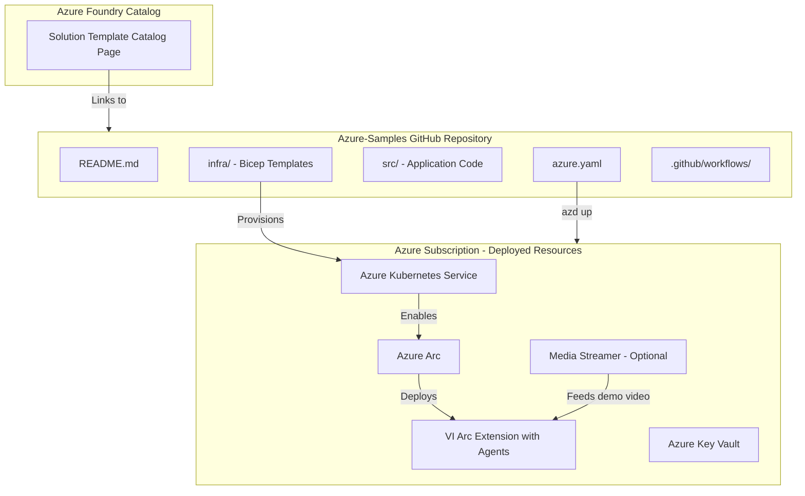
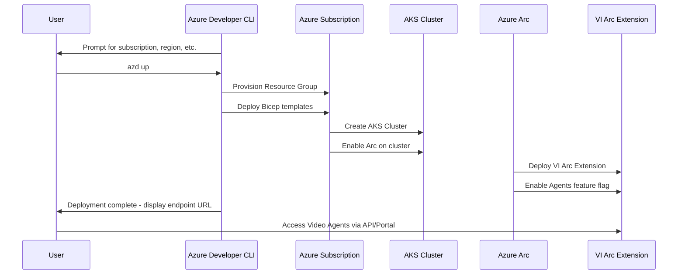

# PRD - Video Agents Foundry Solution Template

<!-- TOC -->

- [Design Review Status](#design-review-status)
  - [Epic Information](#epic-information)
  - [Related Links](#related-links)
- [Terminology](#terminology)
- [Overview](#overview)
  - [What](#what)
  - [Why](#why)
  - [Who](#who)
- [Current State](#current-state)
- [Product Definition of Done - Goals](#product-definition-of-done---goals)
  - [Foundry Solution Template Definition of Done](#foundry-solution-template-definition-of-done)
- [Design and Architecture Changes](#design-and-architecture-changes)
- [High Level Design](#high-level-design)
- [Detailed Design](#detailed-design)
  - [GitHub Repository Structure](#github-repository-structure)
  - [Deployment Automation](#deployment-automation)
  - [Media Streamer Integration](#media-streamer-integration)
  - [Foundry Catalog Onboarding](#foundry-catalog-onboarding)
- [API Design](#api-design)
- [RPaaS](#rpaas)
- [Map](#map)
- [Dependencies](#dependencies)
- [Implication on Horizontal Features](#implication-on-horizontal-features)
- [Impact on Developer Experience](#impact-on-developer-experience)
- [Impact on Quota](#impact-on-quota)
- [Non-Functional Design](#non-functional-design)
  - [Security](#security)
  - [Deployment and DevOps](#deployment-and-devops)
  - [Performance and Scale](#performance-and-scale)
  - [Monitoring](#monitoring)
  - [BCDR](#bcdr)
  - [FairFax](#fairfax)
  - [GDPR and Privacy](#gdpr-and-privacy)
  - [Support](#support)
  - [Documentation](#documentation)
- [Testing](#testing)
- [Open Questions](#open-questions)
- [Exposure Plan](#exposure-plan)

<!-- /TOC -->

## Design Review Status

**Date**: 15/02/2026
**Status**: Under Review

### Epic Information

| Role | Owner |
|------|-------|
| BE Epic Owner | Nassi Harel |
| Leading PM | David |
| BE Developer | Nassi Harel |
| DS Developer | Mattan |

### Related Links

**Epic**: [Epic 36382553](https://msazure.visualstudio.com/One/_workitems/edit/36382553)
**Foundry Definition of Done**: [azd-template-artifacts - Definition of Done](https://github.com/Azure-Samples/azd-template-artifacts/blob/main/docs/development-guidelines/definition-of-done.md)
**Foundry Publishing Guidelines**: [azd-template-artifacts - Publishing Guidelines](https://github.com/Azure-Samples/azd-template-artifacts/blob/main/publishing-guidelines.md)
**Engineering Spec**: [Engineering Spec Video Agents in Foundry Solution Template](https://microsoft.sharepoint.com/:w:/t/VideoIndexerFE/IQD0pHj7ZgC2Rrrju6SnLQBKAXCQQeP1v65FDbIdPQGeOMc?e=ktvxuw)

## Terminology

| Term | Abbreviation | Definition |
|------|-------------|------------|
| Foundry Solution Template | FST | A pre-built, deployable solution template published in the Azure Foundry catalog |
| Azure Developer CLI | azd | CLI tool enabling one-command provisioning and deployment of Azure solutions |
| Azure Kubernetes Service | AKS | Managed Kubernetes container orchestration service on Azure |
| Video Indexer | VI | Microsoft AI-powered video processing and analysis service |
| Azure Arc | Arc | Azure service enabling management of resources across on-premises, multi-cloud, and edge |
| Infrastructure as Code | IaC | Managing infrastructure through declarative configuration files such as Bicep or Terraform |
| Media Streamer | | Component that streams demo camera feeds into VI for showcasing agent capabilities |

## Overview

### What

Expose Video Agents as a Foundry Solution Template in the Azure Foundry catalog. This template will enable users to provision Video Indexer Live with agentic capabilities through a simplified, automated workflow that deploys the solution on Azure using AKS and Azure Arc. The template will be hosted as a public GitHub repository under Azure-Samples and must meet all Foundry Solution Template requirements including README standards, Bicep/IaC automation, CI/CD pipelines, security best practices, and one-click deployment experience.

### Why

1. Increase discoverability and adoption of Video Agents by listing them in the Azure Foundry Solution Template catalog.
2. Simplify the onboarding experience — users can deploy the entire VI + Agents solution with a single `azd up` command.
3. Align with Microsoft-wide initiatives to publish AI solutions as Foundry templates, making Video Agents a first-class citizen in the Azure AI ecosystem.
4. Provide comprehensive documentation and a working demo to reduce time-to-value for customers.

### Who

1. Azure developers and architects seeking pre-built AI video analysis solutions.
2. Enterprise customers exploring agentic video capabilities for security, surveillance, and media workflows.
3. Microsoft internal teams evaluating Video Agents integration patterns.
4. Solution integrators building on top of the Azure AI platform.

## Current State

Video Indexer Arc extension currently supports deployment via Helm charts on AKS with Azure Arc enabled. The AI Agents feature is available as a feature-flagged capability within VI Arc. However, there is no streamlined, one-click provisioning experience through the Azure Foundry catalog, and no public GitHub sample repository exists that packages the full Video Agents deployment end-to-end.

## Product Definition of Done - Goals

### User-Facing Requirements

| ID | Requirement | Priority | Acceptance Criteria |
|----|-------------|----------|---------------------|
| 1 | User can navigate to the Video Agents Foundry Template page in the Foundry catalog | P0 | Template is visible and accessible in the Azure Foundry Solution Template catalog |
| 2 | User can view template description and navigate to the GitHub repository | P0 | Description page includes solution overview, architecture diagram, and link to Azure-Samples repo |
| 3 | User can view detailed documentation in the repository README | P0 | README follows azd template structure with prerequisites, quickstart, architecture details, cost info, and troubleshooting |
| 4 | User can download and run automated deployment via `azd up` | P0 | Single-command deployment provisions all required Azure resources and deploys VI with Agents enabled |

### Foundry Solution Template Definition of Done

Per the [Definition of Done](https://github.com/Azure-Samples/azd-template-artifacts/blob/main/docs/development-guidelines/definition-of-done.md), the following criteria must be met:

#### README Requirements
- [ ] README.md follows the standard azd template README structure
- [ ] Includes architecture diagram showing all deployed Azure resources
- [ ] Lists all prerequisites clearly
- [ ] Provides quickstart instructions including `azd up`
- [ ] Includes cost estimation or link to Azure pricing calculator
- [ ] Documents security considerations
- [ ] Contains troubleshooting section

#### Bicep and IaC Requirements
- [ ] All infrastructure defined in Bicep files under `infra/` directory
- [ ] Uses Bicep modules for each Azure resource
- [ ] Parameterized with sensible defaults
- [ ] Supports `azd up` for one-command deployment
- [ ] Uses `azure.yaml` for azd integration
- [ ] Tags all resources with azd metadata

#### CI/CD Pipeline Requirements
- [ ] GitHub Actions workflow for CI validation
- [ ] Pipeline validates Bicep templates
- [ ] Pipeline runs linting checks
- [ ] Automated tests included in pipeline

#### Security Requirements
- [ ] Uses managed identities instead of connection strings where possible
- [ ] No secrets or keys committed to the repository
- [ ] Follows Azure security baselines
- [ ] Uses Key Vault for any secret management
- [ ] RBAC configured with least-privilege access

#### Cost Optimization
- [ ] Default SKUs are cost-efficient for demonstration
- [ ] Cost estimation documentation provided
- [ ] Resource cleanup instructions included

#### UX and One-Click Experience
- [ ] `azd up` work end-to-end
- [ ] Clear prompts for required user inputs during deployment
- [ ] Post-deployment instructions to access the running application

#### AI-Specific Requirements
- [ ] Responsible AI documentation included
- [ ] Model deployment uses managed endpoints where applicable
- [ ] Content safety measures documented

#### Publishing Guidelines Compliance
- [ ] Repository is public under Azure-Samples organization
- [ ] Template metadata registered in the Foundry catalog
- [ ] Meets minimum scoring criteria per publishing guidelines
- [ ] Regional availability documented

## Design and Architecture Changes

This feature does not modify the existing VI Arc extension codebase. Instead, it creates a new external GitHub repository under Azure-Samples that contains:

- **Bicep/IaC templates** for provisioning AKS, Azure Arc, and VI resources
- **Deployment automation scripts** for end-to-end deployment
- **Documentation** including README, architecture diagrams, and guides
- **Optional Media Streamer component** to provide a demo camera feed
- **GitHub Actions CI/CD** for template validation

The key integration point is between the Foundry Solution Template and the existing VI Arc extension deployment mechanisms.

## High Level Design



### Deployment Flow



## Detailed Design

### GitHub Repository Structure

The repository must follow the Azure-Samples azd template structure:

```
video-agents-solution-template/
├── .devcontainer/                  # Dev container configuration
│   └── devcontainer.json
├── .github/
│   └── workflows/
│       ├── azure-dev.yml           # CI/CD pipeline for azd
│       └── validate.yml            # Template validation
├── infra/
│   ├── main.bicep                  # Main Bicep entry point
│   ├── main.parameters.json        # Default parameters
│   ├── core/
│   │   ├── aks.bicep               # AKS cluster definition
│   │   ├── arc.bicep               # Azure Arc enablement
│   │   ├── keyvault.bicep          # Key Vault for secrets
│   │   ├── monitoring.bicep        # Log Analytics / monitoring
│   │   └── network.bicep           # VNet and networking
│   └── modules/
│       ├── vi-extension.bicep      # VI Arc Extension deployment
│       └── media-streamer.bicep    # Optional Media Streamer
├── src/
│   └── (optional local app code)
├── azure.yaml                      # azd project definition
├── README.md                       # Main documentation
├── SECURITY.md                     # Security policy
├── LICENSE                         # MIT License
├── CONTRIBUTING.md                 # Contribution guidelines
└── CODE_OF_CONDUCT.md              # Code of conduct
```

### Deployment Automation

The deployment automation will use Azure Developer CLI with Bicep templates:

1. **`azure.yaml`** — Defines the azd project, services, and infrastructure hooks
2. **`infra/main.bicep`** — Orchestrates all Azure resource provisioning:
   - Resource Group
   - AKS Cluster with appropriate node pools
   - Azure Arc enablement on the AKS cluster
   - VI Arc Extension with Agents feature flag enabled
   - Azure Key Vault for secrets
   - Monitoring with Log Analytics
   - Optional: Media Streamer for demo camera
3. **Pre/post deployment hooks** — Scripts that run after infrastructure provisioning to configure VI settings, deploy Helm charts, and validate the deployment

### Media Streamer Integration

An optional Media Streamer component can be deployed alongside VI to provide a demo camera feed, enabling new users to immediately experience the Video Agents capabilities without connecting their own cameras.

- The Media Streamer will be deployed as a container in the AKS cluster
- It will simulate a camera feed using pre-recorded demo video
- Deployment is opt-in via an azd parameter

### Foundry Catalog Onboarding

To onboard to the Foundry Solution Template catalog:

1. Create the public GitHub repository under Azure-Samples
2. Register the template with the Foundry catalog team
3. Provide metadata including title, description, tags, architecture diagram
4. Pass all scoring criteria from the publishing guidelines
5. Complete Privacy, Security, and CELA reviews

## API Design

No new APIs are introduced by this feature. The solution template deploys the existing VI Arc Extension APIs. Users interact with the standard VI API endpoints after deployment. Refer to the [AI Agent PRD](../AI%20Agent/AI-Agent-prd.md) for the full API contract documentation.

## RPaaS

No RPaaS changes required. This feature creates an external GitHub repository and deployment automation; it does not modify the VI resource provider.

## Map

No Map changes required.

## Dependencies

| Dependency | Type | Risk | Mitigation |
|------------|------|------|------------|
| Azure Foundry Catalog team | External | Approval timeline uncertainty | Early engagement; assumption that general approval was given |
| Azure-Samples GitHub organization | External | Repository creation and OSS review process | Initiate OSS review early |
| Azure Arc and AKS availability | Platform | Regional availability limitations | Document supported regions; test across target regions |
| VI Arc Extension with Agents | Internal | Agents feature flag stability | Coordinate with Agents team to ensure stability before publishing |
| Media Streamer component | Internal | New component to expose as part of VI | Design as optional; decouple from core template |
| Privacy/CELA review | Process | Timeline risk | Start review process early in the milestone |
| Security review | Process | Timeline risk | Follow Azure security baselines from the start |

## Implication on Horizontal Features

- **Account delete**: No impact. The solution template provisions new resources; it does not modify account lifecycle.
- **Account migration**: No impact. This is a new standalone deployment template.

## Impact on Developer Experience

- **New repository**: A new public GitHub repository will need to be created and maintained under Azure-Samples.
- **Docker compose**: No changes to existing docker compose files. The solution template uses AKS/Helm for deployment.
- **Team training**: Team members will need to understand:
  - Azure Developer CLI and azd template authoring
  - Bicep module authoring and testing
  - Foundry Solution Template requirements and publishing process
  - GitHub Actions CI/CD for template validation

## Impact on Quota

- **CPU**: The deployed AKS cluster will consume CPU/GPU quota in the target Azure subscription. Default SKUs should be cost-efficient for demonstration purposes.
- **Pre-flight assessment**: Before rollout, verify that:
  1. Default AKS node pool sizes are appropriate across target regions
  2. GPU quota for inference workloads is documented as a prerequisite
  3. Cost estimation is included in the README
  4. Resource cleanup instructions are provided to prevent unnecessary spend

## Non-Functional Design

### Security

- Managed identities used for all service-to-service authentication
- Azure Key Vault for any required secrets
- No secrets or connection strings committed to the repository
- RBAC configured with least-privilege access on all deployed resources
- Network security groups and VNet isolation for AKS
- Follow Azure security baselines
- Security review required before publishing — file concerns at <https://aka.ms/RTMTemplate>

### Deployment and DevOps

- GitHub Actions CI/CD pipeline validates Bicep templates on every PR
- `azd up` provides the full deployment experience
- Template supports idempotent deployments via `azd provision`
- Resource cleanup via `azd down`

_"The solution template will deploy all resources via azd CLI using Bicep. No changes to existing VI deployment pipelines are required. GitHub Actions will validate template integrity on each commit."_

### Performance and Scale

- Default deployment targets a small-scale demonstration environment
- Users can scale AKS node pools after deployment based on their workload
- Documentation will include guidance on scaling for production use

_"The default AKS node pool configuration is sized for demonstration. Production scaling guidance is provided in the README."_

### Monitoring

- Azure Monitor and Log Analytics deployed as part of the template
- AKS monitoring enabled with Container Insights
- VI metrics available through standard VI monitoring channels

_"The template deploys Log Analytics and Container Insights for monitoring. A dashboard for key VI metrics will be documented."_

### BCDR

No impact on VI BCDR. The solution template provisions resources in a single region. Multi-region deployment is out of scope for the initial template.

### FairFax

Out of scope for initial release. FairFax support can be added in a future iteration if there is demand and the VI Arc extension supports it.

### GDPR and Privacy

- Privacy/CELA review required before publishing the template
- The template itself does not process or store customer data — it provisions infrastructure
- Video data processing GDPR considerations are handled by the deployed VI Arc extension
- Responsible AI documentation will be included per Foundry template AI-specific requirements

_"Privacy review must be completed by 15/03/2026. The solution template provisions infrastructure only; customer data handling is governed by VI privacy policies."_

### Support

- TSG documentation for common deployment issues
- Troubleshooting section in the README
- GitHub Issues enabled on the repository for community support
- CSS should be made aware of the new Foundry template and common deployment failure scenarios

_"CSS should be aware of the new Video Agents Foundry template. A TSG will cover common deployment issues including AKS provisioning failures, Arc enablement problems, and VI extension deployment errors."_

### Documentation

The following documentation deliverables are required:

- **README.md**: Comprehensive template documentation following azd standards, including architecture diagram, prerequisites, quickstart, cost estimation, security considerations, and troubleshooting
- **SECURITY.md**: Security policy and vulnerability reporting process
- **CONTRIBUTING.md**: Contribution guidelines for the public repository
- **In-repo guides**: Detailed deployment customization and scaling guides
- **Foundry catalog page**: Solution description, screenshots, and metadata for the catalog listing

_"The README will follow the Azure-Samples azd template structure. Architecture diagrams and cost estimation will be included. The Foundry catalog page will link to the GitHub repository."_

## Testing

### 1. Template Validation Tests
- Bicep template linting and validation via `az bicep build`
- `azd` template validation checks
- Parameter validation with valid and invalid inputs

### 2. End-to-End Deployment Tests
- Full `azd up` deployment to a test subscription
- Verification that all Azure resources are provisioned correctly
- Verification that VI Arc extension is deployed and agents are enabled
- Verification that the API is reachable post-deployment
- `azd down` cleanup validation

### 3. Integration Tests
- Validate connectivity between AKS, Arc, and VI extension
- Validate Media Streamer connectivity to VI if deployed
- Validate agent chat functionality end-to-end after deployment

### 4. CI/CD Pipeline Tests
- GitHub Actions workflow runs successfully on PR
- Bicep lint and validation pass
- Template structure validation passes

## Open Questions

| Question | Status | Owner |
|----------|--------|-------|
| Should we support existing AKS or VI deployments, or only provision new ones | Open | Nassi |
| Is there a way to enable the Agents feature flag by default in the UI for deployed clients | Open | Nassi |
| Should we deploy a Media Streamer with a demo camera to preset capabilities for the user | Open | Nassi |
| Timeline for OSS review, Privacy/CELA review, and Security review | Open | Nassi |
| What is the alternative to a one-click local run experience for the Foundry requirement | Open | Nassi |
| Maintenance process — should template updates be manual or automated | Open | Nassi |

## Exposure Plan

### Milestones

| Milestone | Target Date | Owner |
|-----------|------------|-------|
| Research on Foundry Template | 10/02/2026 | Nassi |
| Mini Design Review | 18/02/2026 | Nassi |
| Create the GitHub repo using Foundry template | 22/02/2026 | Nassi |
| Create Automation and Documentation in the GitHub Repo | 26/02/2026 | Nassi |
| Expose Media Streamer as part of VI | 01/03/2026 | Nassi |
| Mini BugBash | 01/03/2026 | All |
| Privacy/Security/CELA Reviews | 15/03/2026 | Nassi |
| Onboarding Foundry Solution Template Catalog | 16/03/2026 | Nassi |

### Rollout Strategy

1. **Internal Testing**
   - Deploy template to internal test subscription
   - Team validation and bug bash
   - Verify all Definition of Done criteria are met
   - Pass CI/CD pipeline validation

2. **Review Phase**
   - OSS review for public repository
   - Privacy/CELA review
   - Security review
   - Foundry catalog team review and scoring

3. **Limited Release**
   - Publish to Azure-Samples as public repository
   - Register in Foundry catalog as preview
   - Gather feedback from early adopters

4. **General Availability**
   - Full listing in Foundry Solution Template catalog
   - Public documentation and blog announcement
