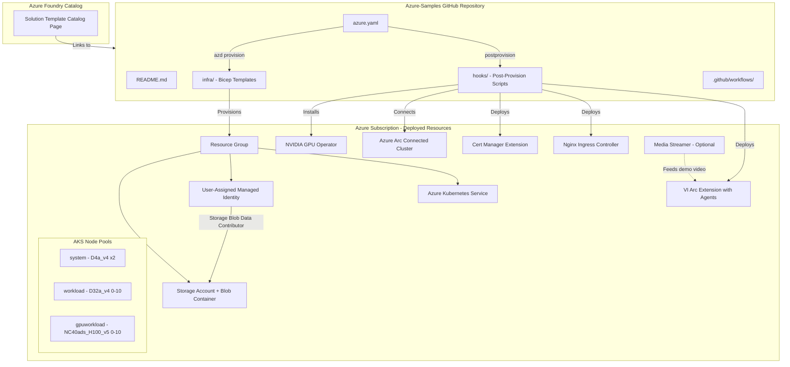
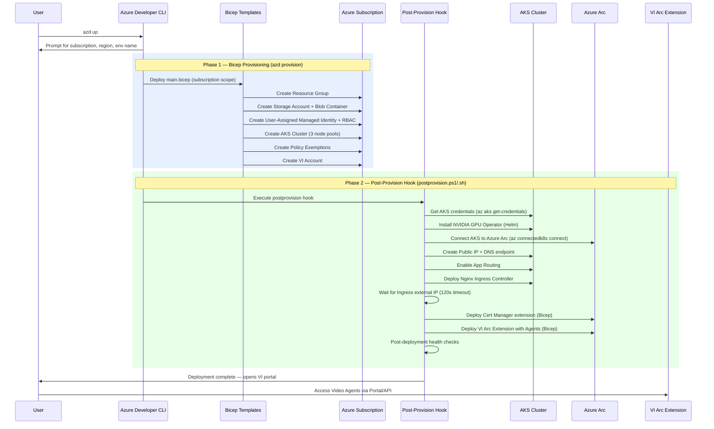

# PRD - Video Agents Foundry Solution Template

<!-- TOC -->

- [Design Review Status](#design-review-status)
  - [Epic Information](#epic-information)
  - [Related Links](#related-links)
- [Terminology](#terminology)
- [Overview](#overview)
  - [What](#what)
  - [Why](#why)
  - [Who](#who)
- [Current State](#current-state)
- [Product Definition of Done - Goals](#product-definition-of-done---goals)
  - [Foundry Solution Template Definition of Done](#foundry-solution-template-definition-of-done)
- [Design and Architecture Changes](#design-and-architecture-changes)
- [High Level Design](#high-level-design)
- [Detailed Design](#detailed-design)
  - [GitHub Repository Structure](#github-repository-structure)
  - [Deployment Automation](#deployment-automation)
  - [Media Streamer Integration](#media-streamer-integration)
  - [Foundry Catalog Onboarding](#foundry-catalog-onboarding)
- [API Design](#api-design)
- [RPaaS](#rpaas)
- [Map](#map)
- [Dependencies](#dependencies)
- [Implication on Horizontal Features](#implication-on-horizontal-features)
- [Impact on Developer Experience](#impact-on-developer-experience)
- [Impact on Quota](#impact-on-quota)
- [Non-Functional Design](#non-functional-design)
  - [Security](#security)
  - [Deployment and DevOps](#deployment-and-devops)
  - [Performance and Scale](#performance-and-scale)
  - [Monitoring](#monitoring)
  - [BCDR](#bcdr)
  - [FairFax](#fairfax)
  - [GDPR and Privacy](#gdpr-and-privacy)
  - [Support](#support)
  - [Documentation](#documentation)
- [Testing](#testing)
- [Open Questions](#open-questions)
- [Exposure Plan](#exposure-plan)

<!-- /TOC -->

## Design Review Status

**Date**: 22/02/2026 
**Status**: Implementation In Progress

### Epic Information

| Role | Owner |
|------|-------|
| BE Epic Owner | Nassi Harel |
| Leading PM | David |
| BE Developer | Nassi Harel |
| DS Developer | Mattan |

### Related Links

**Epic**: [Epic 36382553](https://msazure.visualstudio.com/One/_workitems/edit/36382553)
**Foundry Definition of Done**: [azd-template-artifacts - Definition of Done](https://github.com/Azure-Samples/azd-template-artifacts/blob/main/docs/development-guidelines/definition-of-done.md)
**Foundry Publishing Guidelines**: [azd-template-artifacts - Publishing Guidelines](https://github.com/Azure-Samples/azd-template-artifacts/blob/main/publishing-guidelines.md)
**Engineering Spec**: [Engineering Spec Video Agents in Foundry Solution Template](https://microsoft.sharepoint.com/:w:/t/VideoIndexerFE/IQD0pHj7ZgC2Rrrju6SnLQBKAXCQQeP1v65FDbIdPQGeOMc?e=ktvxuw)

## Terminology

| Term | Abbreviation | Definition |
|------|-------------|------------|
| Foundry Solution Template | FST | A pre-built, deployable solution template published in the Azure Foundry catalog |
| Azure Developer CLI | azd | CLI tool enabling one-command provisioning and deployment of Azure solutions |
| Azure Kubernetes Service | AKS | Managed Kubernetes container orchestration service on Azure |
| Video Indexer | VI | Microsoft AI-powered video processing and analysis service |
| Azure Arc | Arc | Azure service enabling management of resources across on-premises, multi-cloud, and edge |
| Infrastructure as Code | IaC | Managing infrastructure through declarative configuration files such as Bicep or Terraform |
| Media Streamer | | Component that streams demo camera feeds into VI for showcasing agent capabilities |
| NVIDIA GPU Operator | | Kubernetes operator that automates management of GPU resources on nodes |
| Cert Manager | | Kubernetes extension for automated TLS certificate management |
| Post-Provision Hook | | Script executed by azd after Bicep provisioning completes, used for Kubernetes-level configuration |
| Policy Exemption | | Azure Policy waiver for specific compliance rules that conflict with required deployment configurations |

## Overview

### What

Expose Video Agents as a Foundry Solution Template in the Azure Foundry catalog. This template will enable users to provision Video Indexer Live with agentic capabilities through a simplified, automated workflow that deploys the solution on Azure using AKS and Azure Arc. The template will be hosted as a public GitHub repository under Azure-Samples and must meet all Foundry Solution Template requirements including README standards, Bicep/IaC automation, CI/CD pipelines, security best practices, and one-click deployment experience.

### Why

1. Increase discoverability and adoption of Video Agents by listing them in the Azure Foundry Solution Template catalog.
2. Simplify the onboarding experience — users can deploy the entire VI + Agents solution with a single `azd up` command.
3. Align with Microsoft-wide initiatives to publish AI solutions as Foundry templates, making Video Agents a first-class citizen in the Azure AI ecosystem.
4. Provide comprehensive documentation and a working demo to reduce time-to-value for customers.

### Who

1. Azure developers and architects seeking pre-built AI video analysis solutions.
2. Enterprise customers exploring agentic video capabilities for security, surveillance, and media workflows.
3. Microsoft internal teams evaluating Video Agents integration patterns.
4. Solution integrators building on top of the Azure AI platform.

## Current State

Video Indexer Arc extension currently supports deployment via Helm charts on AKS with Azure Arc enabled. The AI Agents feature is available as a feature-flagged capability within VI Arc. However, there is no streamlined, one-click provisioning experience through the Azure Foundry catalog, and no public GitHub sample repository exists that packages the full Video Agents deployment end-to-end.

### Implementation Progress

the following components have been implemented in the repository:

| Component | Status | Notes |
|-----------|--------|-------|
| GitHub repository scaffolding | 🔄 In Progress | Full azd template structure with all standard files |
| `azure.yaml` with azd integration | 🔄 In Progress | Provision-only workflow with cross-platform postprovision hooks |
| Bicep IaC (`infra/`) | 🔄 In Progress | Subscription-scoped `main.bicep` with 7 modules |
| Postprovision hooks (PS1 + Bash) | 🔄 In Progress | 10-step deployment pipeline for Arc, GPU operator, ingress, and VI extension |
| CI/CD pipelines | ✅ Done | `azure-dev.yml` (deploy + security scan) and `pr-gate.yml` (template validation) |
| README.md | ✅ Done | Full azd template README with architecture diagrams, prerequisites, quickstart |
| Dev container | 🔄 In Progress | azd, Azure CLI, VS Code extensions |
| Media Streamer Bicep module | 🔄 In Progress | `media-streamer.bicep` module exists but not yet wired into hooks |


## Product Definition of Done - Goals

### User-Facing Requirements

| ID | Requirement | Priority | Acceptance Criteria |
|----|-------------|----------|---------------------|
| 1 | User can navigate to the Video Agents Foundry Template page in the Foundry catalog | P0 | Template is visible and accessible in the Azure Foundry Solution Template catalog |
| 2 | User can view template description and navigate to the GitHub repository | P0 | Description page includes solution overview, architecture diagram, and link to Azure-Samples repo |
| 3 | User can view detailed documentation in the repository README | P0 | README follows azd template structure with prerequisites, quickstart, architecture details, cost info, and troubleshooting |
| 4 | User can download and run automated deployment via `azd up` | P0 | Single-command deployment provisions all required Azure resources and deploys VI with Agents enabled |

### Foundry Solution Template Definition of Done

Per the [Definition of Done](https://github.com/Azure-Samples/azd-template-artifacts/blob/main/docs/development-guidelines/definition-of-done.md), the following criteria must be met:

#### README Requirements
- [ ] README.md follows the standard azd template README structure
- [ ] Includes architecture diagram showing all deployed Azure resources
- [ ] Lists all prerequisites clearly
- [ ] Provides quickstart instructions including `azd up`
- [ ] Includes cost estimation or link to Azure pricing calculator
- [ ] Documents security considerations
- [ ] Contains troubleshooting section

#### Bicep and IaC Requirements
- [ ] All infrastructure defined in Bicep files under `infra/` directory
- [ ] Uses Bicep modules for each Azure resource (7 modules: AKS, VI account, VI extension, storage, managed identity, cert-manager, optional policy exemption)
- [ ] Parameterized with sensible defaults (via `main.bicepparam` reading from azd environment variables)
- [ ] Supports `azd up` for one-command deployment
- [ ] Uses `azure.yaml` for azd integration (provision-only workflow with postprovision hooks)
- [ ] Tags all resources with azd metadata

#### CI/CD Pipeline Requirements
- [ ] GitHub Actions workflow for CI validation (`pr-gate.yml` using `microsoft/template-validation-action@v0.0.2`)
- [ ] Pipeline validates Bicep templates (via Microsoft Security DevOps template analyzer in `azure-dev.yml`)
- [ ] Pipeline runs linting checks (template validation action)
- [ ] Automated tests included in pipeline

#### Security Requirements
- [ ] Uses managed identities instead of connection strings where possible (user-assigned managed identity with Storage Blob Data Contributor role; system-assigned identity on AKS)
- [ ] No secrets or keys committed to the repository
- [ ] Follows Azure security baselines (TLS 1.2 minimum, HTTPS-only, public blob access disabled, shared key access disabled on storage)
- [ ] Uses Key Vault for any secret management — _Decision: Key Vault module not used; managed identity + RBAC replaces secret-based access patterns_
- [ ] RBAC configured with least-privilege access (Storage Blob Data Contributor scoped to specific storage account)

#### Cost Optimization
- [ ] Default SKUs are cost-efficient for demonstration — _Note: Current defaults use Standard_D4a_v4 (system), Standard_D32a_v4 (workload), Standard_NC40ads_H100_v5 (GPU) — GPU SKU may be expensive for demos_
- [ ] Cost estimation documentation provided
- [ ] Resource cleanup instructions included

#### UX and One-Click Experience
- [x] `azd up` works end-to-end (provision + postprovision hooks handle full deployment)
- [x] Clear prompts for required user inputs during deployment (subscription, region via azd env)
- [x] Post-deployment instructions to access the running application (hooks open VI portal on completion)

#### AI-Specific Requirements
- [ ] Responsible AI documentation included
- [ ] Model deployment uses managed endpoints where applicable
- [ ] Content safety measures documented

#### Publishing Guidelines Compliance
- [ ] Repository is public under Azure-Samples organization
- [ ] Template metadata registered in the Foundry catalog
- [ ] Meets minimum scoring criteria per publishing guidelines
- [ ] Regional availability documented

## Design and Architecture Changes

This feature does not modify the existing VI Arc extension codebase. Instead, it creates a new external GitHub repository under Azure-Samples that contains:

- **Bicep/IaC templates** for provisioning AKS, Storage, Managed Identity, VI Account, and Policy Exemptions
- **Post-provision hooks** (PowerShell + Bash) for Arc connectivity, GPU operator, ingress, cert-manager, and VI extension deployment
- **Arc extension Bicep modules** for Cert Manager and VI Extension (deployed via hooks onto the Arc-connected cluster)
- **Documentation** including README, architecture diagrams, and guides
- **Optional Media Streamer Bicep module** (stub) to provide a demo camera feed
- **GitHub Actions CI/CD** for template validation and security scanning

The key architectural decision is the **two-phase deployment model**: Bicep handles base Azure resource provisioning at subscription scope, while post-provision hooks handle Kubernetes-level configuration (GPU operator, Arc connection, ingress, extensions) that cannot be expressed purely in Bicep.

## High Level Design



### Deployment Flow

The deployment is split into two phases: Bicep provisioning (via `azd provision`) and post-provision configuration (via `hooks/postprovision.ps1` or `hooks/postprovision.sh`).



## Detailed Design

### GitHub Repository Structure

The repository follows the Azure-Samples azd template structure. Below is the **actual implemented structure**:

```
video-agents-foundry-solution/
├── .azure/                            # azd environment configuration (gitignored values)
├── .devcontainer/
│   └── devcontainer.json              # Dev container: azd, Docker-in-Docker, Azure CLI
├── .github/
│   ├── ISSUE_TEMPLATE.md              # Issue template for community support
│   └── workflows/
│       ├── azure-dev.yml              # CI/CD: deploy + Microsoft Security DevOps scan
│       └── pr-gate.yml                # PR gate: template validation via microsoft/template-validation-action
├── .vscode/                           # VS Code workspace settings
├── docs/
│   └── images/readme/                 # Architecture diagrams and README images
│       ├── architecture.png
│       ├── agent_flow.png
│       └── (other images)
├── hooks/
│   ├── postprovision.ps1              # Post-provision script (PowerShell, 383 lines)
│   └── postprovision.sh               # Post-provision script (Bash, 346 lines)
├── infra/
│   ├── abbreviations.json             # Azure resource naming conventions
│   ├── main.bicep                     # Main entry point (subscription-scoped, 168 lines)
│   ├── main.bicepparam                # Parameters from azd environment variables
│   └── modules/
│       ├── aks.bicep                   # AKS cluster (3 node pools, GPU support)
│       ├── cert-manager.bicep          # Cert Manager Arc extension
│       ├── managed-identity.bicep      # User-assigned managed identity + RBAC
│       ├── policy-exemption.bicep      # Azure Policy exemptions
│       ├── storage.bicep               # Storage account (hardened, no shared key)
│       ├── vi-account.bicep            # Video Indexer account
│       ├── vi-extension.bicep          # VI Arc extension with Agents feature flags
│       └── media-streamer.bicep        # Media Streamer (optional, stub)
├── azure.yaml                         # azd project definition (provision-only workflow)
├── README.md                          # Comprehensive documentation
├── SECURITY.md                        # Security policy
├── LICENSE                            # MIT License
├── CONTRIBUTING.MD                    # Contribution guidelines
├── CODE_OF_CONDUCT.md                 # Code of conduct
└── NOTICE.txt                         # Third-party notices
```

> **Differences from original design:**
> - No `src/` directory — the template provisions infrastructure only; no local application code is deployed
> - Added `hooks/` directory for cross-platform post-provision automation
> - Added `policy-exemption.bicep` for temporary Azure Policy exemptions required by VideoIndexer-Dev subscription.

### Deployment Automation

The deployment automation uses a two-phase approach: Bicep provisioning followed by post-provision hooks.

#### Phase 1: Bicep Provisioning (`azd provision`)

1. **`azure.yaml`** — Defines the azd project with a provision-only workflow and cross-platform postprovision hooks (PowerShell for Windows, Bash for POSIX)
2. **`infra/main.bicep`** — Subscription-scoped deployment orchestrating all base Azure resources:
   - Resource Group (named via `abbreviations.json` conventions)
   - Storage Account with blob container (`vi-arc-container`) — hardened with shared key access disabled, no public blob access, TLS 1.2
   - User-Assigned Managed Identity with Storage Blob Data Contributor role
   - AKS Cluster with three node pools:
     - `system`: Standard_D4a_v4, 2 fixed nodes, AzureLinux
     - `workload`: Standard_D32a_v4, 0–10 autoscaling nodes, AzureLinux
     - `gpuworkload`: Standard_NC40ads_H100_v5, 0–10 autoscaling nodes, Ubuntu, GPU taint, deepstream label
   - Policy Exemptions (AKS CSI driver shared key access, GPU Operator container images)
   - Video Indexer Account (linked to storage via managed identity)
3. **`infra/main.bicepparam`** — Reads parameters from azd environment variables: `AZURE_ENV_NAME`, `AZURE_LOCATION`, `AZURE_RESOURCE_GROUP`, `AZURE_PRINCIPAL_ID`, `CREATE_ROLE_FOR_USER` (default: true), `KUBERNETES_VERSION` (default: 1.32)

#### Phase 2: Post-Provision Hooks (`hooks/postprovision.ps1` / `hooks/postprovision.sh`)

Cross-platform scripts (PowerShell and Bash) that execute a 10-step deployment pipeline:

| Step | Action | Details |
|------|--------|---------|
| 1 | Get AKS credentials | `az aks get-credentials` |
| 2 | Install NVIDIA GPU Operator | Helm chart v25.10.01 |
| 3 | Connect AKS to Azure Arc | `az connectedk8s connect` with idempotency check |
| 4 | Create Public IP + DNS endpoint | Constructs VI endpoint URI (HTTP-based) |
| 5 | Enable App Routing on AKS | `az aks approuting enable` |
| 6 | Deploy Nginx Ingress Controller | Kubernetes ingress deployment |
| 7 | Verify Ingress Controller | Waits up to 120s for external IP assignment |
| 8 | Deploy Cert Manager extension | Via `cert-manager.bicep` on Arc |
| 9 | Deploy VI Arc Extension | Via `vi-extension.bicep` with all feature flags (agents, live video, media uploads, media server streams, live summarization) |
| 10 | Post-deployment health checks | Validates Arc status, GPU pods, VI pods |

**Key design decisions:**
- Hooks are **idempotent** — they check for existing resources before creating
- Azure provider registration is handled automatically (`Microsoft.Kubernetes`, `Microsoft.KubernetesConfiguration`, `Microsoft.ExtendedLocation`)
- Prerequisites validation checks for `helm`, `kubectl`, and `az` CLI with required extensions
- Configuration is persisted to the azd environment for subsequent runs
- Only executes if `CREATE_IN_LOCAL` environment variable is not `"false"`
- On completion, the VI portal is opened automatically in the user's browser

### Media Streamer Integration

An optional Media Streamer component can be deployed alongside VI to provide a demo camera feed, enabling new users to immediately experience the Video Agents capabilities without connecting their own cameras.

- The Media Streamer will be deployed as a container in the AKS cluster
- It will simulate a camera feed using pre-recorded demo video
- Deployment is opt-in via an azd parameter

### Foundry Catalog Onboarding

To onboard to the Foundry Solution Template catalog:

1. Create the public GitHub repository under Azure-Samples
2. Register the template with the Foundry catalog team
3. Provide metadata including title, description, tags, architecture diagram
4. Pass all scoring criteria from the publishing guidelines
5. Complete Privacy, Security, and CELA reviews

## API Design

No new APIs are introduced by this feature. The solution template deploys the existing VI Arc Extension APIs. Users interact with the standard VI API endpoints after deployment. Refer to the [AI Agent PRD](../AI%20Agent/AI-Agent-prd.md) for the full API contract documentation.

## RPaaS

No RPaaS changes required. This feature creates an external GitHub repository and deployment automation; it does not modify the VI resource provider.

## Map

No Map changes required.

## Dependencies

| Dependency | Type | Risk | Status |Mitigation |
|------------|------|------|--------|-----------|
| Azure Foundry Catalog team | External | Approval timeline uncertainty | Pending | Early engagement; assumption that general approval was given |
| Azure-Samples GitHub organization | External | Repository creation and OSS review process | Pending | Initiate OSS review early |
| Azure Arc and AKS availability | Platform | Regional availability limitations | Mitigated | Default region set to eastus2; document supported regions |
| VI Arc Extension with Agents | Internal | Agents feature flag stability | Implemented | Feature flags enabled in `vi-extension.bicep` configuration |
| Media Streamer component | Internal | New component to expose as part of VI | Stub | Bicep module exists; not yet wired into postprovision hooks |
| Privacy/CELA review | Process | Timeline risk | Pending | Start review process early in the milestone |
| Security review | Process | Timeline risk | Partially mitigated | MSDO security scanning in CI; formal review still needed |
| NVIDIA GPU Operator | External | Helm chart compatibility | Implemented | Pinned to v25.10.01; installed via hooks |
| H100 GPU quota (NCadsH100v5) | Platform | Restricted SKU, requires quota request | Risk | Document as prerequisite; may limit regional availability |
| Azure CLI extensions | Tooling | `connectedk8s`, `k8s-extension` required | Implemented | Auto-installed in postprovision hooks |
| `microsoft/template-validation-action` | External | Action version pinned at v0.0.2 | Implemented | Monitor for updates |
| VI subscription approval | External | Users must be approved via [registration form](https://aka.ms/vi-register) | Documented | Documented in README as prerequisite |

## Implication on Horizontal Features

- **Account delete**: No impact. The solution template provisions new resources; it does not modify account lifecycle.
- **Account migration**: No impact. This is a new standalone deployment template.

## Impact on Developer Experience

- **New repository**: A new public GitHub repository will need to be created and maintained under Azure-Samples.
- **Docker compose**: No changes to existing docker compose files. The solution template uses AKS/Helm for deployment.
- **Dev container**: A `.devcontainer/devcontainer.json` is provided with pre-configured azd, Docker-in-Docker, Azure CLI, and relevant VS Code extensions (Bicep, Azure Functions, Docker, GitHub Actions).
- **Cross-platform support**: Both PowerShell and Bash postprovision hooks ensure developers on Windows, macOS, and Linux can deploy.
- **Team training**: Team members will need to understand:
  - Azure Developer CLI and azd template authoring
  - Bicep module authoring and testing (subscription-scoped deployments, bicepparam files)
  - Foundry Solution Template requirements and publishing process
  - GitHub Actions CI/CD for template validation
  - Helm chart operations (NVIDIA GPU Operator installation)
  - Azure Arc extension deployment patterns

## Impact on Quota

- **CPU/GPU**: The deployed AKS cluster provisions the following VM SKUs that consume subscription quota:
  - `Standard_D4a_v4` × 2 (system pool — always on)
  - `Standard_D32a_v4` × 0–10 (workload pool — autoscaling)
  - `Standard_NC40ads_H100_v5` × 0–10 (GPU pool — autoscaling, **H100 GPU quota required**)
- **Pre-flight assessment**: Before rollout, verify that:
  1. H100 GPU quota (`NCadsH100v5` family) is available in the target region — this is a restricted SKU that requires quota request
  2. Default region is `eastus2` — ensure quota availability in this region
  3. GPU quota for inference workloads is documented as a prerequisite in the README
  4. Cost estimation is included in the README (H100 instances are high-cost)
  5. Resource cleanup instructions are provided to prevent unnecessary spend (`azd down`)
  6. Autoscaling min of 0 on GPU pool helps minimize costs when idle

## Non-Functional Design

### Security

**Implemented security controls:**

- **Managed identities**: User-assigned managed identity for VI-to-storage communication; system-assigned identity on AKS cluster
- **Storage hardening**: Shared key access disabled, public blob access disabled, HTTPS-only, TLS 1.2 minimum
- **RBAC**: Storage Blob Data Contributor scoped to specific storage account; Contributor on managed identity resource
- **Workload identity**: OIDC issuer and workload identity enabled on AKS for pod-level identity
- **Image security**: AKS image cleaner enabled with 24-hour interval
- **No secrets in repository**: All sensitive values read from azd environment variables at deployment time
- **Policy exemptions**: Explicit waiver-based exemptions for AKS CSI driver shared key access and GPU Operator container images (documented and auditable)
- **Security scanning**: Microsoft Security DevOps template analyzer runs in CI/CD pipeline, with SARIF results uploaded to GitHub Security tab

**Not yet implemented:**
- Azure Key Vault module — replaced by managed identity + RBAC pattern
- Network security groups and VNet isolation for AKS — AKS uses kubenet plugin with standard load balancer; no VNet module implemented
- Security review required before publishing — file concerns at <https://aka.ms/RTMTemplate>

### Deployment and DevOps

**Implemented:**

- **`azure-dev.yml`**: GitHub Actions CI/CD pipeline triggered on push to `main` and manual dispatch. Runs Microsoft Security DevOps Analysis (template analyzer), uploads SARIF results to GitHub Security tab, then provisions and deploys via `azd`
- **`pr-gate.yml`**: PR validation pipeline using `microsoft/template-validation-action@v0.0.2`. Posts validation results as PR comments automatically
- **`azd up`** (mapped to `azd provision` in `azure.yaml`) provides the full deployment experience with postprovision hooks
- **Idempotent hooks**: Post-provision scripts check for existing resources before creating, supporting re-runs
- **Cross-platform**: Both PowerShell (`postprovision.ps1`) and Bash (`postprovision.sh`) scripts ensure Windows, macOS, and Linux support
- Resource cleanup via `azd down`

_"The solution template deploys base Azure resources via Bicep and configures Kubernetes-level components via postprovision hooks. Two GitHub Actions workflows handle CI/CD deployment and PR gate validation with security scanning."_

### Performance and Scale

**Implemented AKS node pool configuration:**

| Pool | VM SKU | OS | Count | Autoscaling | Notes |
|------|--------|----|-------|-------------|-------|
| `system` | Standard_D4a_v4 | AzureLinux | 2 (fixed) | No | System workloads |
| `workload` | Standard_D32a_v4 | AzureLinux | 0–10 | Yes | VI processing workloads |
| `gpuworkload` | Standard_NC40ads_H100_v5 | Ubuntu | 0–10 | Yes | GPU workloads with NVIDIA taint, deepstream node selector |

- AKS auto-upgrade channel: node-image
- GPU workload pool uses taints (`sku=gpu:NoSchedule`) to prevent non-GPU pod scheduling
- NVIDIA GPU Operator (v25.10.01) installed via Helm for GPU management
- Users can scale node pools after deployment based on their workload
- Documentation will include guidance on scaling for production use

> **Note:** The GPU SKU (Standard_NC40ads_H100_v5) is a high-end H100 GPU instance. Cost implications should be clearly documented as a prerequisite, and the autoscaling min of 0 helps minimize costs when GPU workloads are idle.

_"The AKS cluster is configured with three node pools. GPU workloads autoscale from 0 to 10 nodes to optimize cost. Production scaling guidance will be provided in the README."_

### Monitoring

**Current status:**

- VI metrics are available through standard VI monitoring channels once the extension is deployed.

### BCDR

No impact on VI BCDR. The solution template provisions resources in a single region. Multi-region deployment is out of scope for the initial template.

### FairFax

Out of scope for initial release. FairFax support can be added in a future iteration if there is demand and the VI Arc extension supports it.

### GDPR and Privacy

- Privacy/CELA review required before publishing the template
- The template itself does not process or store customer data — it provisions infrastructure
- Video data processing GDPR considerations are handled by the deployed VI Arc extension
- Responsible AI documentation will be included per Foundry template AI-specific requirements

_"Privacy review must be completed by 15/03/2026. The solution template provisions infrastructure only; customer data handling is governed by VI privacy policies."_

### Support

- TSG documentation for common deployment issues
- Troubleshooting section in the README
- GitHub Issues enabled on the repository for community support
- CSS should be made aware of the new Foundry template and common deployment failure scenarios

_"CSS should be aware of the new Video Agents Foundry template. A TSG will cover common deployment issues including AKS provisioning failures, Arc enablement problems, and VI extension deployment errors."_

### Documentation

The following documentation deliverables are required:

- **README.md**: Comprehensive template documentation following azd standards, including architecture diagram, prerequisites, quickstart, cost estimation, security considerations, and troubleshooting
- **SECURITY.md**: Security policy and vulnerability reporting process
- **CONTRIBUTING.md**: Contribution guidelines for the public repository
- **In-repo guides**: Detailed deployment customization and scaling guides
- **Foundry catalog page**: Solution description, screenshots, and metadata for the catalog listing

_"The README will follow the Azure-Samples azd template structure. Architecture diagrams and cost estimation will be included. The Foundry catalog page will link to the GitHub repository."_

## Testing

### 1. Template Validation Tests
- Bicep template linting and validation via `az bicep build`
- `azd` template validation checks via `microsoft/template-validation-action@v0.0.2` (implemented in `pr-gate.yml`)
- Microsoft Security DevOps template analyzer (implemented in `azure-dev.yml`)
- Parameter validation with valid and invalid inputs

### 2. End-to-End Deployment Tests
- Full `azd up` deployment to a test subscription (provision + postprovision hooks)
- Verification that all Azure resources are provisioned correctly (Resource Group, Storage, Managed Identity, AKS, VI Account, Policy Exemptions)
- Verification that postprovision hooks complete all 10 steps successfully
- Verification that NVIDIA GPU Operator pods are running
- Verification that Arc connection is established
- Verification that VI Arc extension is deployed and agents are enabled
- Verification that the API is reachable via the Nginx ingress endpoint
- `azd down` cleanup validation

### 3. Integration Tests
- Validate connectivity between AKS, Arc, and VI extension
- Validate ingress controller is reachable with external IP
- Validate Media Streamer connectivity to VI if deployed
- Validate agent chat functionality end-to-end after deployment

### 4. CI/CD Pipeline Tests
- `pr-gate.yml` workflow runs successfully on PR and posts validation results as PR comments
- `azure-dev.yml` workflow runs successfully on push to main
- Security scan results uploaded to GitHub Security tab
- Template structure validation passes

### 5. Cross-Platform Tests
- `postprovision.ps1` (PowerShell) executes successfully on Windows
- `postprovision.sh` (Bash) executes successfully on Linux/macOS
- Both scripts produce identical deployment outcomes

## Open Questions

| Question | Status | Resolution | Owner |
|----------|--------|------------|-------|
| Should we support existing AKS or VI deployments, or only provision new ones | Resolved | Template provisions new resources only; postprovision hooks include idempotency checks for re-runs but do not support attaching to pre-existing clusters | Nassi |
| Is there a way to enable the Agents feature flag by default in the UI for deployed clients | Resolved | Agents feature flag is enabled in `vi-extension.bicep` configuration settings along with live video, media uploads, media server streams, and live summarization flags | Nassi |
| Should we deploy a Media Streamer with a demo camera to preset capabilities for the user | Partially Resolved | `media-streamer.bicep` module stub exists but is not yet wired into the postprovision hooks; deployment is intended to be opt-in | Nassi |
| Timeline for OSS review, Privacy/CELA review, and Security review | Open | Target: 15/03/2026 | Nassi |
| What is the alternative to a one-click local run experience for the Foundry requirement | Resolved | Dev container configuration provides a local dev environment with azd, Docker-in-Docker, and Azure CLI pre-installed; `azd up` is the one-command experience | Nassi |
| Maintenance process — should template updates be manual or automated | Open | | Nassi |
| Should Key Vault be added for secret management, or is managed identity + RBAC sufficient | New | Current implementation uses managed identity + RBAC without Key Vault; evaluate if this meets Foundry security requirements | Nassi |
| Should a monitoring module (Log Analytics / Container Insights) be added | New | Not yet implemented; may be required for Foundry Definition of Done | Nassi |
| Should VNet isolation / network security be added for AKS | New | Current implementation uses kubenet without VNet module; evaluate production security posture | Nassi |
| Is HTTP-only endpoint acceptable for the VI extension, or is HTTPS/TLS required before publishing | New | Postprovision hooks create HTTP endpoint; cert-manager is deployed but HTTPS is noted as a future configuration | Nassi |

## Exposure Plan

### Milestones

| Milestone | Target Date | Status | Owner |
|-----------|------------|--------|-------|
| Research on Foundry Template | 10/02/2026 | ✅ Done | Nassi |
| Mini Design Review | 18/02/2026 | ✅ Done | Nassi |
| Create the GitHub repo using Foundry template | 22/02/2026 | ✅ Done | Nassi |
| Create Automation and Documentation in the GitHub Repo | 26/02/2026 | 🔄 In Progress — Bicep, hooks, README, CI/CD implemented; monitoring, media streamer integration, cost docs remaining | Nassi |
| Expose Media Streamer as part of VI | 01/03/2026 | 🔲 Not Started — Bicep stub exists | Nassi |
| Mini BugBash | 01/03/2026 | 🔲 Not Started | All |
| Privacy/Security/CELA Reviews | 15/03/2026 | 🔲 Not Started | Nassi |
| Onboarding Foundry Solution Template Catalog | 16/03/2026 | 🔲 Not Started | Nassi |

### Rollout Strategy

1. **Internal Testing**
   - Deploy template to internal test subscription
   - Team validation and bug bash
   - Verify all Definition of Done criteria are met
   - Pass CI/CD pipeline validation

2. **Review Phase**
   - OSS review for public repository
   - Privacy/CELA review
   - Security review
   - Foundry catalog team review and scoring

3. **Limited Release**
   - Publish to Azure-Samples as public repository
   - Register in Foundry catalog as preview
   - Gather feedback from early adopters

4. **General Availability**
   - Full listing in Foundry Solution Template catalog
   - Public documentation and blog announcement
