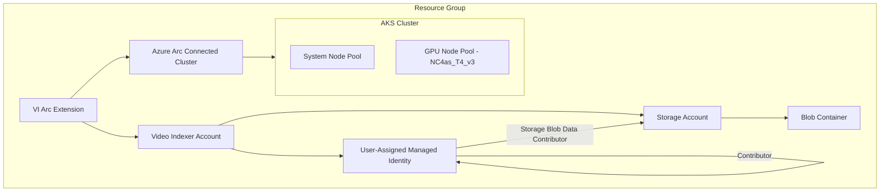
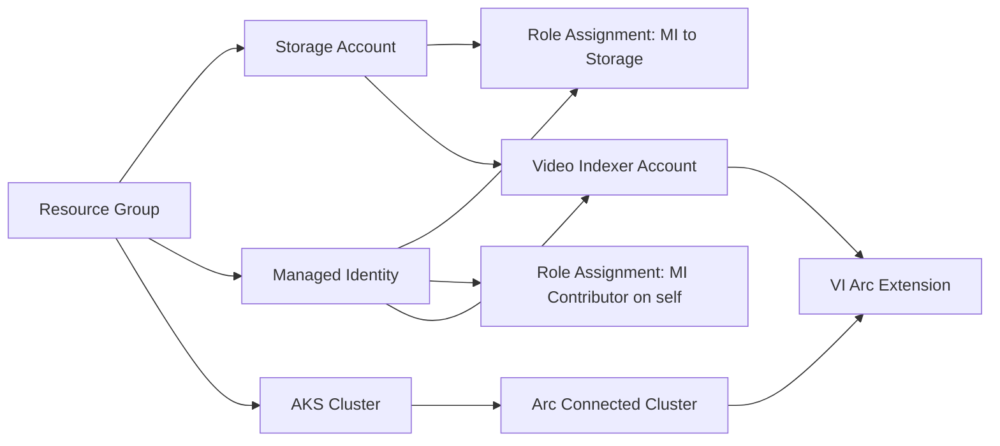

# Bicep Solution Plan - Video Indexer Enabled by Arc on AKS

## Overview

Deployment Flow
azd provision → deploys infra/main.bicep (Storage, MI, AKS, Video Indexer account)
Post-provision hook → connects AKS to Azure Arc via az connectedk8s connect
Post-provision hook → deploys infra/modules/vi-extension.bicep on the Arc-connected cluster

This plan converts the manual CLI-based setup from the [AKS-CLUSTER-SETUP.md](https://raw.githubusercontent.com/Azure-Samples/azure-video-indexer-samples/refs/heads/master/VideoIndexerEnabledByArc/aks/AKS-CLUSTER-SETUP.md) guide into a modular Bicep Infrastructure-as-Code solution, deployed via Azure Developer CLI (`azd`).

## Architecture Diagram



## Resource Dependency Flow



## File Structure

```
infra/
  main.bicep              # Main orchestration - subscription-level deployment
  main.bicepparam         # Parameter file with azd environment variables
  modules/
    storage.bicep          # Storage Account + Blob container
    managed-identity.bicep # User-Assigned Managed Identity + role assignments
    aks.bicep              # AKS Cluster with GPU node pool
    vi-account.bicep       # Video Indexer Account
    vi-extension.bicep     # Video Indexer Arc Extension on Arc-connected cluster
hooks/
  postprovision.ps1       # Post-provision: Arc-connect AKS cluster
  postprovision.sh        # Post-provision: Arc-connect AKS cluster (Linux/Mac)
```

## Detailed Module Specifications

### 1. `infra/main.bicep` - Main Orchestration

**Deployment scope:** `subscription`

**Parameters:**
| Parameter | Type | Description |
|-----------|------|-------------|
| `environmentName` | string | Environment name prefix for resource naming |
| `resourceGroupName` | string | Resource group name - defaults to `rg-{environmentName}` |
| `location` | string | Azure region for all resources |
| `principalId` | string | Current user principal ID for RBAC |
| `createRoleForUser` | bool | Whether to create role assignments for the user |
| `kubernetesVersion` | string | Kubernetes version for AKS - default `1.32.10` |
| `gpuVmSize` | string | GPU VM SKU - default `Standard_NC4as_T4_v3` |
| `gpuNodeCount` | int | Number of GPU nodes - default `1` |
| `viAccountName` | string | Video Indexer account name |
| `storageAccountName` | string | Storage account name |

**Responsibilities:**
- Create the resource group via `targetScope = 'subscription'`
- Orchestrate all module deployments in correct dependency order
- Pass outputs between modules

---

### 2. `infra/modules/storage.bicep` - Storage Account

**Deployment scope:** `resourceGroup`

**Resources:**
- `Microsoft.Storage/storageAccounts@2023-05-01` - Standard_LRS, StorageV2
- `Microsoft.Storage/storageAccounts/blobServices/containers@2023-05-01` - Blob container named `vi-arc-container`

**Parameters:**
| Parameter | Type | Description |
|-----------|------|-------------|
| `name` | string | Storage account name |
| `location` | string | Azure region |
| `tags` | object | Resource tags |

**Outputs:**
| Output | Type | Description |
|--------|------|-------------|
| `id` | string | Storage account resource ID |
| `name` | string | Storage account name |

---

### 3. `infra/modules/managed-identity.bicep` - Managed Identity + Roles

**Deployment scope:** `resourceGroup`

**Resources:**
- `Microsoft.ManagedIdentity/userAssignedIdentities@2023-01-31` - User-assigned managed identity
- `Microsoft.Authorization/roleAssignments@2022-04-01` - Storage Blob Data Contributor role on storage account
- `Microsoft.Authorization/roleAssignments@2022-04-01` - Contributor role on the managed identity itself

**Parameters:**
| Parameter | Type | Description |
|-----------|------|-------------|
| `name` | string | Managed identity name |
| `location` | string | Azure region |
| `tags` | object | Resource tags |
| `storageAccountId` | string | Storage account resource ID for role assignment |

**Outputs:**
| Output | Type | Description |
|--------|------|-------------|
| `id` | string | Managed identity resource ID |
| `principalId` | string | Managed identity principal ID |
| `clientId` | string | Managed identity client ID |
| `name` | string | Managed identity name |

**Key Role Definitions:**
- Storage Blob Data Contributor: `ba92f5b4-2d11-453d-a403-e96b0029c9fe`
- Contributor: `b24988ac-6180-42a0-ab88-20f7382dd24c`

---

### 4. `infra/modules/aks.bicep` - AKS Cluster

**Deployment scope:** `resourceGroup`

**Resources:**
- `Microsoft.ContainerService/managedClusters@2024-01-01` - AKS cluster with:
  - System-assigned managed identity
  - System node pool: `Standard_DS2_v2`, count 1-3, auto-scaling
  - GPU agent pool: configurable GPU VM size, manual scaling, `Ubuntu` OS, taint `sku=gpu:NoSchedule`
  - Network plugin: `azure`
  - RBAC enabled

**Parameters:**
| Parameter | Type | Description |
|-----------|------|-------------|
| `name` | string | AKS cluster name |
| `location` | string | Azure region |
| `tags` | object | Resource tags |
| `kubernetesVersion` | string | Kubernetes version |
| `gpuVmSize` | string | GPU node VM size |
| `gpuNodeCount` | int | Number of GPU nodes |
| `systemVmSize` | string | System node VM size - default `Standard_DS2_v2` |

**Outputs:**
| Output | Type | Description |
|--------|------|-------------|
| `id` | string | AKS cluster resource ID |
| `name` | string | AKS cluster name |
| `principalId` | string | AKS system-assigned identity principal ID |

---

### 5. `infra/modules/vi-account.bicep` - Video Indexer Account

**Deployment scope:** `resourceGroup`

**Resources:**
- `Microsoft.VideoIndexer/accounts@2024-01-01` - Video Indexer account linked to storage and managed identity

**Parameters:**
| Parameter | Type | Description |
|-----------|------|-------------|
| `name` | string | VI account name |
| `location` | string | Azure region |
| `tags` | object | Resource tags |
| `storageAccountId` | string | Storage account resource ID |
| `managedIdentityId` | string | User-assigned managed identity resource ID |

**Outputs:**
| Output | Type | Description |
|--------|------|-------------|
| `id` | string | Video Indexer account resource ID |
| `name` | string | Video Indexer account name |
| `accountId` | string | Video Indexer account GUID |

---

### 6. `infra/modules/vi-extension.bicep` - Video Indexer Arc Extension

**Deployment scope:** `resourceGroup`

**Resources:**
- `Microsoft.KubernetesConfiguration/extensions@2023-05-01` - VI extension on the Arc-connected cluster
  - Extension type: `Microsoft.VideoIndexer`
  - Auto-upgrade minor version enabled
  - Release train: `stable`
  - Configuration settings for storage and identity

**Parameters:**
| Parameter | Type | Description |
|-----------|------|-------------|
| `arcClusterName` | string | Arc-connected cluster resource name |
| `viAccountId` | string | Video Indexer account resource ID |
| `storageAccountId` | string | Storage account resource ID |
| `managedIdentityClientId` | string | Managed identity client ID |
| `managedIdentityId` | string | Managed identity resource ID |

**Outputs:**
| Output | Type | Description |
|--------|------|-------------|
| `id` | string | Extension resource ID |
| `name` | string | Extension name |

---

## Post-Provision Scripts

### Why scripts are needed

The Azure Arc connection for AKS requires `az connectedk8s connect` CLI commands that interact with the Kubernetes API and cannot be fully expressed in Bicep. The post-provisioning scripts will:

1. Get AKS credentials via `az aks get-credentials`
2. Connect AKS to Azure Arc via `az connectedk8s connect`
3. Export the Arc cluster resource name to azd environment for subsequent use

### Alternative: Two-Phase Deployment

Since the VI Arc Extension depends on the Arc-connected cluster existing first, there are two approaches:

**Option A - Post-provision script creates Arc connection, then triggers a second Bicep deployment for the extension:**
- `main.bicep` deploys everything except the VI extension
- Post-provision script connects AKS to Arc
- Post-provision script runs `az deployment group create` for the VI extension

**Option B - Post-provision script handles both Arc connection and VI extension via CLI:**
- `main.bicep` deploys everything except Arc and VI extension
- Post-provision script handles Arc connection + VI extension creation via CLI

**Recommended: Option A** - This keeps as much as possible in Bicep while using scripts only for what cannot be done declaratively.

---

## Parameters File Updates

The `infra/main.bicepparam` file needs to be updated with additional environment variables:

```
using './main.bicep'

param environmentName = readEnvironmentVariable('AZURE_ENV_NAME', 'MY_ENV')
param resourceGroupName = readEnvironmentVariable('AZURE_RESOURCE_GROUP', '')
param location = readEnvironmentVariable('AZURE_LOCATION', 'eastus2')
param principalId = readEnvironmentVariable('AZURE_PRINCIPAL_ID', '')
param createRoleForUser = bool(readEnvironmentVariable('CREATE_ROLE_FOR_USER', 'true'))
param kubernetesVersion = readEnvironmentVariable('KUBERNETES_VERSION', '1.32')
param gpuVmSize = readEnvironmentVariable('GPU_VM_SIZE', 'Standard_NC4as_T4_v3')
param gpuNodeCount = int(readEnvironmentVariable('GPU_NODE_COUNT', '1'))
```

---

## Important Notes

1. **GPU VM Quotas** - The guide specifies `Standard_NC4as_T4_v3` GPU VMs. Users must ensure they have sufficient quota in their target region. The existing `scripts/listAIQuotas.ps1` can help verify this.

2. **Arc Connection** - `az connectedk8s connect` is a CLI-only operation that requires kubectl access to the cluster. This cannot be done in Bicep and must remain in post-provision scripts.

3. **API Versions** - The Video Indexer Bicep resource type `Microsoft.VideoIndexer/accounts` and the Arc extension type `Microsoft.KubernetesConfiguration/extensions` should use the latest stable API versions available.

4. **Region Availability** - Video Indexer enabled by Arc is available only in specific regions. The deployment should validate or document supported regions.

5. **Existing azd Integration** - The solution preserves the existing `azure.yaml` workflow structure with `azd provision` triggering `main.bicep` and post-provision hooks.
